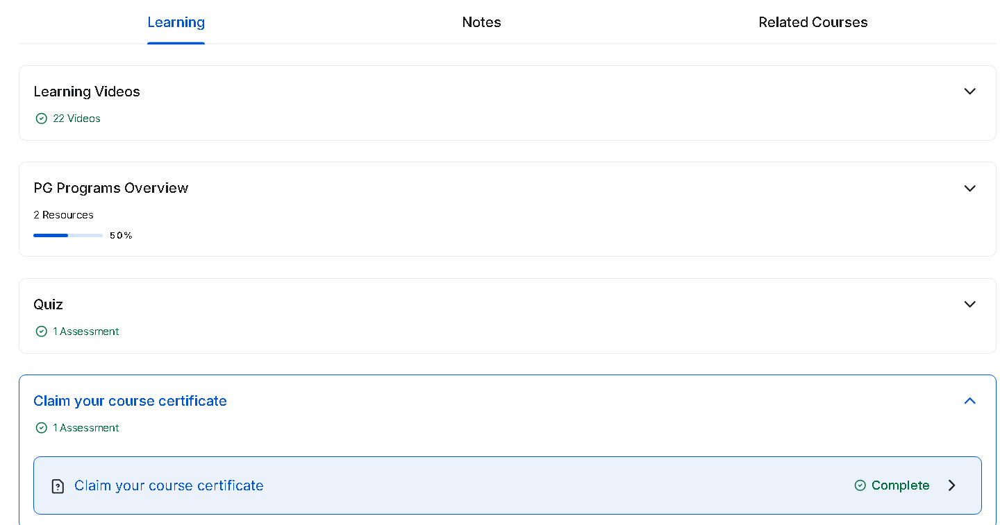

# 📱 Ethical Hacking – Mobile Platforms & Network Architecture

This repository documents my learning and practice from the **"Ethical Hacking – Mobile Platforms and Network Architecture"** course by [Great Learning](https://www.mygreatlearning.com/). It includes course notes, security analysis, practice demos, screenshots, and certificate.

---

## 📜 Certificate

---

## 📒 Topics Covered

- 📱 Mobile device vulnerabilities
- 📶 Wi-Fi & GSM attack surfaces
- 🧪 Mobile app exploitation
- 🛡️ Defense techniques (App hardening, VPNs)
- 🧠 Threat modeling and case studies

---

## 📂 Structure

| Folder | Description |
|--------|-------------|
| `notes/` | Course notes by topic |
| `demo/` | Scripts, simulated attacks, or configs |
| `analysis/` | Advanced security modeling and use cases |
| `screenshots/` | Lab screenshots, slides, proof |
| `cert/` | Certificate of course completion |
| `LICENSE` | AGPLv3 license details |

---

## 📘 Notes

- [`mobile-platform-threats.md`](./notes/mobile-platform-threats.md)
- [`telecom-architecture.md`](./notes/telecom-architecture.md)
- [`wifi-attacks.md`](./notes/wifi-attacks.md)
- [`countermeasures.md`](./notes/countermeasures.md)

---

## 💻 Demo

- [`rogue-ap-attack.md`](./demo/rogue-ap-attack.md)
- [`mitmproxy-wifi-intercept.md`](./demo/mitmproxy-wifi-intercept.md)
- [`imsi-catcher-theory.md`](./demo/imsi-catcher-theory.md)

---

## 🔎 Advanced Analysis

- [`threat-model.md`](./analysis/threat-model.md) – STRIDE model on mobile/Wi-Fi threats
- [`redteam-playbook.md`](./analysis/redteam-playbook.md) – Red Team checklist for field testing
- [`case-study.md`](./analysis/case-study.md) – Real-world examples of network/mobile exploitation

---

## 📸 Screenshots

| Description | Screenshot |
|-------------|------------|
| 📜 Learning Overview |  |

---

## 📝 Course Review

This course provides a strong foundation in ethical hacking, specifically targeting mobile platforms and telecom infrastructure. It blends theory with modern, relevant attack surfaces and includes defensive considerations.

✅ **What I liked**:
- Focused content on mobile security and telecom systems
- Easy-to-understand yet practical examples
- Great primer for anyone aiming for mobile Red Teaming

📌 **To Improve**:
- More hands-on labs or capture-the-flag (CTF)-style challenges
- Deeper Android/iOS app reverse engineering sections

---

## 🛠️ In Process

Some notes and case studies may still be under development. Contributions or suggestions welcome.

---

## ⚖️ License

This project is licensed under the **GNU AGPLv3 License**.  
See [`LICENSE`](./LICENSE) for details.

© 2025 ngvuthdanh. All rights reserved.

---

## ❗ Disclaimer

All content in this repository is for **educational purposes only**.  
By using any material here, you agree:

- Not to apply any technique on unauthorized systems
- That the author holds no responsibility for misuse
- To use these resources ethically and legally

See [`DISCLAIMER.md`](./DISCLAIMER.md) for full terms.

## ✍️ Author

**Thành Danh** – Cybersecurity Student & Red Team Learner  
GitHub: [@ngvuthdanh](https://github.com/ngvuthdanh)  
Email: `ngvu.thdanh@gmail.com`
